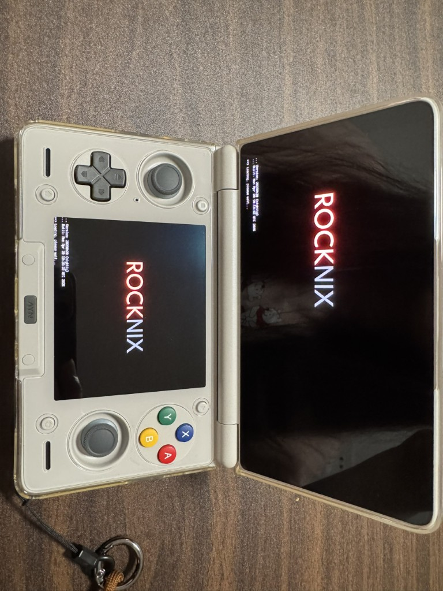
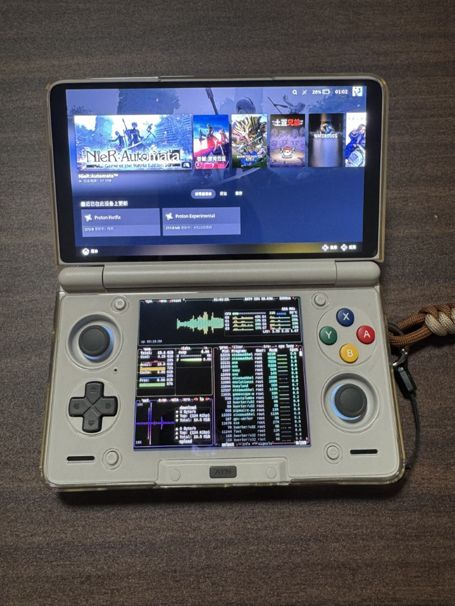
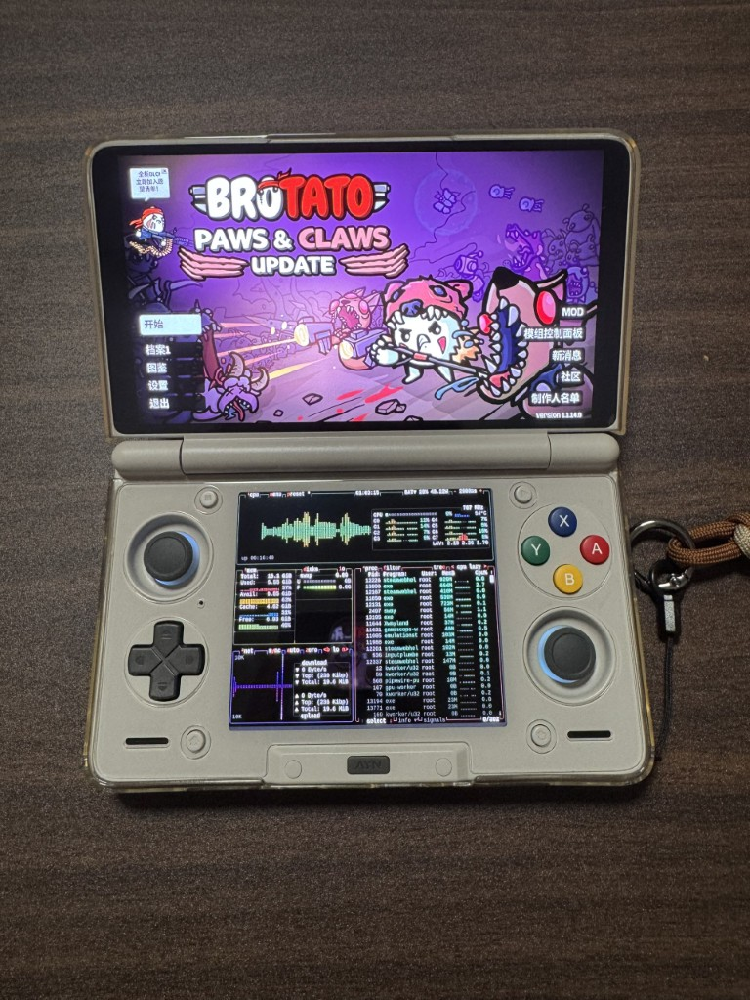
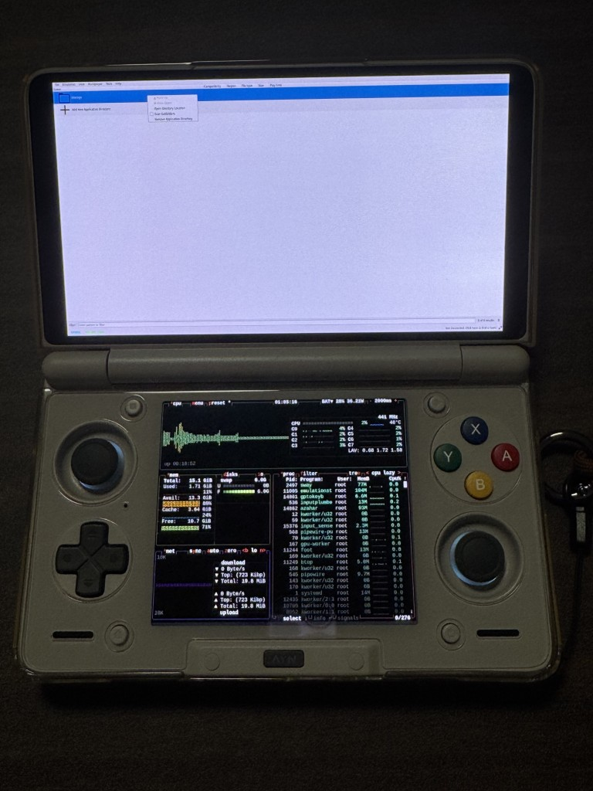

+++
title = 'Ayn Thor Linux(Rocknix) 的安装和折腾过程'
date = 2026-04-24T09:20:33+08:00
description = "记录在 Ayn Thor 双屏掌机上安装 Rocknix、运行 Steam 的折腾和踩坑过程。包括重分区，字体，steam 时区，虚拟键盘等等"
tags = ["玩机","Rocknix","Ayn Thor","Linux 掌机","Steam","FEX","双屏掌机"]
+++

就在几天前，听说 Rocknix 项目支持运行 Steam 了，立刻下单 Thor 开始折腾，之前想玩双屏寨机很久了，不过想着安卓系统就算了，这能运行 Linux 甚至还能跑 Steam ，高低得折腾一下

## 时效警告

**下文中的折腾如果无特殊提及版本，均为 nightly 20250419 版本**

## 折腾的结果

1. 硬件上双屏没问题，系统前端不支持双屏，Steam 等也不支持双屏，在非 DS 类模拟器运行的情况下，下屏基本算是摆设(可通过命令在下屏启动轻量的监视器等，参阅我的另一篇文章 [Rocknix 中屏幕键盘的配置](../rocknix/rocknix-1/))。

2. Steam 启动非常慢(首次安装更慢)，但是启动起来后比较流畅，轻量级的游戏也非常流畅(后续在我更新后的 nightly-20260511 版本中，已经有了 arm 原生 steam 倒是快了非常多，不过新增的 game scope，不打开这个模式的话，默认启动的是小屏版，你按 home 键开启大屏版后，下次启动会卡加载动画，启动 game scope 的话，它会关闭 sway，你的下屏基本没用了，更严重的是触摸是有问题的)。

3. 官方只支持两种 VPN ，并没有喜闻乐见的 Xray 等网络工具的支持，折腾需要透明代理，或者自己想办法使用 SSH 进去运行 。
   
4. 缺少系统级中文(其实是 CJK 都缺)字体，需要自己安装，不安装的话只有游戏前端支持中文，Steam 以及其他模拟器中会变为方框。
   
5. Steam 应用内，时区没有默认设置，需要手动配置。
   
6. 兼容性差强人意，我测试过的几个游戏

    - 土豆兄弟(Brotato) 完美运行
    - 尼尔：机械纪元(NieR:Automata) 能进游戏，<del>止步于创建角色，即使我唤醒 Steam 屏幕键盘，也无法输入名字，</del>配置好  [屏幕键盘](../rocknix/rocknix-1/) 后完美运行。
    - 怪物猎人崛起(MONSTER HUNTER RISE) 闪退，我还在想办法折腾(调整了一堆东西也没跑起来，我放弃了)。
    - 看门狗(Watch Dogs) 报错后死机，我对运行起来不抱什么希望了。
  

7. 目前没有很方便的方法直接安装在 UFS 中，需要 TF 卡，我选择了把安卓的 userdata 分区切分出一部分挂载在 Rocknix 上，这样可以把一些大型游戏安装在 UFS 上，提升一些运行性能。

8. 安装在 TF 卡上的 Rocknix 中的游戏的资源文件，会被安卓系统上的相册扫描到，需要自己手动在 `/storage/roms` 下写一个 `.nomedia` 空文件，不要直接写在 `/storage` 下，写在这里不会生效。

## 图





## 折腾详情

### 备份

干什么之前先备份就不用说了吧， 9008 很好进，公板 8gen2 firehose 文件可用，管他这的那的先全盘备份再说。

救砖:  完全关机的情况下，按住 `音量+` 和 `音量-` 插数据线进入 EDL(9008) 模式，接下来的操作能看到这文章的你肯定比我还熟。

### 安装系统

1. 去 [https://github.com/ROCKNIX/distribution-nightly/releases](https://github.com/ROCKNIX/distribution-nightly/releases) 下载最新 nightly。
   
2. 看 [https://rocknix.org/play/install/](https://rocknix.org/play/install/) 安装。


### 分区：把 UFS 分一些给 Rocknix 

真有这方面需求，我现在建议参考 [https://rocknix.org/play/installtointernal/](https://rocknix.org/play/installtointernal/) ，直接安装到 UFS 上，下面被折叠的所有操作，其实都是因为在我折腾的版本，还没有更新这个功能。不过我还是要提醒一下，做这种事之前走 edl 备份一下，而且这种安装会动 userdata，所以最起码要备份 lun0 的 GPT 分区表，最好有 xml。

<details>
<summary>非要看的话你就点击展开吧</summary>

**该操作不会保留安卓的用户数据，简单理解就是安卓会被恢复出厂设置，并且该操作可逆性来源于你的完整 edl 备份(一般备份都会绕过 userdata 分区，但是该操作动的就是 userdata，所以最起码要备份 lun0 的 GPT 分区表，最好有 xml)，真想要动手请务必备份，虽然你也可以去安卓那边 root 后使用 sgdisk 来计算扇区，然后重分 userdata 回去，但是这样并不是字节级原厂一致。<del>当然，你也别想着能用这方法保你安卓侧的数据，反正我是没保住，本来想着无损扩容，结果扩容后用户态全炸了，开机卡第二屏，折腾了一晚上最后 wipe 了，好消息是起码卡第二屏的时候 userdata 已解密，只是用户态起不来，我还没数据火葬场</del>，无论如何，先备份。**

懒得整理了，看命令，你需要 SSH 进 Rocknix，之后参考我的命令执行

```
SM8550:~ # cat /proc/partitions | head -n 10
major minor  #blocks  name

   7        0    1925792 loop0
 179        0  249872384 mmcblk0
 179        1    2097152 mmcblk0p1
 179        2  247758848 mmcblk0p2
   8        0  995352576 sda
   8        1       1536 sda1
   8        2       1536 sda2
   8        3       4096 sda3
SM8550:~ #
SM8550:~ #
SM8550:~ # parted /dev/sda print
Model: SKhynix HN8T374ZJKX141 (scsi)
Disk /dev/sda: 1019GB
Sector size (logical/physical): 4096B/4096B
Partition Table: gpt
Disk Flags:

Number  Start   End     Size    File system  Name             Flags
 1      24.6kB  1597kB  1573kB               nvdata1
 2      1597kB  3170kB  1573kB               nvdata2
 3      3170kB  7365kB  4194kB               reserve1
 4      7365kB  11.6MB  4194kB               reserve2
 5      11.6MB  45.1MB  33.6MB  ext4         persist
 6      45.1MB  112MB   67.1MB               qpdata1
 7      112MB   123MB   10.5MB               qpdata2
 8      123MB   123MB   524kB                frp
 9      123MB   124MB   524kB                keystore
10      124MB   124MB   8192B                ssd
11      124MB   2271MB  2147MB               rawdump
12      2271MB  2272MB  1049kB               misc
13      2272MB  2339MB  67.1MB               metadata
14      2339MB  8019MB  5680MB               super
15      8019MB  8019MB  65.5kB               vbmeta_system_a
16      8019MB  8019MB  65.5kB               vbmeta_system_b
17      8019MB  1019GB  1011GB               userdata

SM8550:~ # parted /dev/sda unit s print
Model: SKhynix HN8T374ZJKX141 (scsi)
Disk /dev/sda: 248838144s
Sector size (logical/physical): 4096B/4096B
Partition Table: gpt
Disk Flags:

Number  Start     End         Size        File system  Name             Flags
 1      6s        389s        384s                     nvdata1
 2      390s      773s        384s                     nvdata2
 3      774s      1797s       1024s                    reserve1
 4      1798s     2821s       1024s                    reserve2
 5      2822s     11013s      8192s       ext4         persist
 6      11014s    27397s      16384s                   qpdata1
 7      27398s    29957s      2560s                    qpdata2
 8      29958s    30085s      128s                     frp
 9      30086s    30213s      128s                     keystore
10      30214s    30215s      2s                       ssd
11      30216s    554503s     524288s                  rawdump
12      554504s   554759s     256s                     misc
13      554760s   571143s     16384s                   metadata
14      571144s   1957758s    1386615s                 super
15      1957759s  1957774s    16s                      vbmeta_system_a
16      1957775s  1957790s    16s                      vbmeta_system_b
17      1957791s  248838138s  246880348s               userdata
SM8550:~ #
SM8550:~ #
SM8550:~ # parted /dev/sda
GNU Parted 3.6
Using /dev/sda
Welcome to GNU Parted! Type 'help' to view a list of commands.
(parted) rm 17
rm 17
(parted) mkpart userdata 1957791s 126376860s
mkpart userdata 1957791s 126376860s
Warning: The resulting partition is not properly aligned for best performance:
1957791s % 256s != 0s
Ignore/Cancel? Ignore
Ignore
(parted)

(parted) mkpart linux_data 126376861s 248838138s
mkpart linux_data 126376861s 248838138s
Warning: The resulting partition is not properly aligned for best performance:
126376861s % 256s != 0s
Ignore/Cancel? I
I
(parted) print
print
Model: SKhynix HN8T374ZJKX141 (scsi)
Disk /dev/sda: 1019GB
Sector size (logical/physical): 4096B/4096B
Partition Table: gpt
Disk Flags:

Number  Start   End     Size    File system  Name             Flags
 1      24.6kB  1597kB  1573kB               nvdata1
 2      1597kB  3170kB  1573kB               nvdata2
 3      3170kB  7365kB  4194kB               reserve1
 4      7365kB  11.6MB  4194kB               reserve2
 5      11.6MB  45.1MB  33.6MB  ext4         persist
 6      45.1MB  112MB   67.1MB               qpdata1
 7      112MB   123MB   10.5MB               qpdata2
 8      123MB   123MB   524kB                frp
 9      123MB   124MB   524kB                keystore
10      124MB   124MB   8192B                ssd
11      124MB   2271MB  2147MB               rawdump
12      2271MB  2272MB  1049kB               misc
13      2272MB  2339MB  67.1MB               metadata
14      2339MB  8019MB  5680MB               super
15      8019MB  8019MB  65.5kB               vbmeta_system_a
16      8019MB  8019MB  65.5kB               vbmeta_system_b
17      8019MB  518GB   510GB                userdata
18      518GB   1019GB  502GB                linux_data

(parted) quit
quit
Information: You may need to update /etc/fstab.

SM8550:~ # poweroff
SM8550:~ # Connection to 192.168.10.162 closed by remote host.
Connection to 192.168.10.162 closed.
```

此时重启到安卓操作，如果安卓提示分区损坏需要修复，就修复一下(会丢用户数据)，如果没提示，就进系统后恢复出厂设置(不恢复的话，安卓显示的还是 1TB， 但是实际上我已经把 500GB 分给 Rocknix 了，后续可能会引发一些问题)，确认安卓没问题后，再回 Rocknix 接着配置。


回到 Rocknix 后，需要格式化已经分好的区，使用 `mkfs.ext4` ，那段命令我忘记复制了，格式化完成之后，把它挂载在你喜欢的目录， 下面命令中，我的目录是 `/storage/ufs/` ，在普通 Linux 下，我们编辑 `/etc/fstab` 就可以持久化挂载，重启也生效，但是在 Rocknix 中，除了 `/storage` 都不可写，我们需要去新建一个 `systemd` 模块来实现自动挂载。


<details>
<summary>不要点开看过程了，这里有个大坑，直接看后文吧，你非要看思路的话开也可以</summary>

模块内容如下，我把它命名为 `mount-ufs.service` ，存储在 `/storage/.config/system.d` 中

```
[Unit]
Description=Mount UFS 500G Game Drive
After=local-fs.target

[Service]
Type=oneshot
ExecStartPre=-/usr/bin/mkdir -p /storage/ufs
ExecStart=/usr/bin/mount /dev/sda18 /storage/ufs
RemainAfterExit=yes

[Install]
WantedBy=multi-user.target
```


存储完成后，记得 `systemctl enable mount-ufs.service` 配置开机运行

做完这些，参考下面的命令建立软链接，Rocknix 系统扫描游戏都是在 `roms` 目录下，所以尽量建立软连接来存储数据，不要直接在模拟器等应用中指定数据存在 `/storage/ufs/` 中，这样做的话你的游戏不会被扫描到。

```
SM8550:~/roms/steam #
SM8550:~/roms/steam # cd /storage/ufs/
SM8550:~/ufs # ls
lost+found
SM8550:~/ufs # ps | grep steam
SM8550:~/ufs #
SM8550:~/ufs #
SM8550:~/ufs # ls -la /roms/steam/
total 16
drwxr-xr-x    3 root     root          4096 Apr 21 19:53 .
drwxr-xr-x  141 root     root          4096 Jun 25  2024 ..
-rwxr-xr-x    1 root     root            69 Apr 21 09:27 libraryfolder.vdf
drwxr-xr-x    8 root     root          4096 Apr 21 20:02 steamapps
SM8550:~/ufs #
SM8550:~/ufs #
SM8550:~/ufs # mv /roms/steam/ ./
SM8550:~/ufs # ls
lost+found  steam
SM8550:~/ufs # cd steam/
SM8550:~/ufs/steam # ls
libraryfolder.vdf  steamapps
SM8550:~/ufs/steam # cd ..
SM8550:~/ufs # ls -n /storage/ufs/steam /storage/roms/steam
ls: /storage/roms/steam: No such file or directory
/storage/ufs/steam:
total 8
-rwxr-xr-x    1 0        0               69 Apr 21 09:27 libraryfolder.vdf
drwxr-xr-x    8 0        0             4096 Apr 21 20:02 steamapps
SM8550:~/ufs #
SM8550:~/ufs # mkdir -p /storage/roms/steam
SM8550:~/ufs # ls -n /storage/ufs/steam /storage/roms/steam
/storage/roms/steam:
total 0

/storage/ufs/steam:
total 8
-rwxr-xr-x    1 0        0               69 Apr 21 09:27 libraryfolder.vdf
drwxr-xr-x    8 0        0             4096 Apr 21 20:02 steamapps
SM8550:~/ufs #
SM8550:~/ufs # ls -la /storage/roms/steam
total 8
drwxr-xr-x    2 root     root          4096 Apr 21 20:07 .
drwxr-xr-x  141 root     root          4096 Apr 21 20:07 ..
SM8550:~/ufs # ls -la /storage/roms/steam/
total 8
drwxr-xr-x    2 root     root          4096 Apr 21 20:07 .
drwxr-xr-x  141 root     root          4096 Apr 21 20:07 ..
SM8550:~/ufs # ls /storage/roms/steam/
SM8550:~/ufs # rm -r /storage/roms/steam
SM8550:~/ufs #
SM8550:~/ufs # ln -s /storage/ufs/steam/ /storage/roms/steam
SM8550:~/ufs #
SM8550:~/ufs #
SM8550:~/ufs # ls -la /storage/roms/ | grep steam
lrwxrwxrwx    1 root     root            19 Apr 21 20:09 steam -> /storage/ufs/steam/
SM8550:~/ufs # cd /storage/roms/
SM8550:~/roms # cd st
st-v/  steam/
SM8550:~/roms # cd steam
SM8550:~/roms/steam # ls
libraryfolder.vdf  steamapps
SM8550:~/roms/steam # ls -la
total 16
drwxr-xr-x    3 root     root          4096 Apr 21 19:53 .
drwxr-xr-x    4 root     root          4096 Apr 21 20:06 ..
-rwxr-xr-x    1 root     root            69 Apr 21 09:27 libraryfolder.vdf
drwxr-xr-x    8 root     root          4096 Apr 21 20:02 steamapps
SM8550:~/roms/steam #
```

</details>

2026-05-12 更新：

**不要使用上面的 systemd 挂载分区，格式化完成后，正确的做法是直接在 rocknix 的设置内进行恢复出厂设置， rocknix 会自动扫描非安卓的块，然后接管你分好的分区。**

**如果你使用了我上面的挂载，在下次 ota 更新，或者恢复出厂设置时，会发现你的软链接被 rocknix 搞乱掉了。**

</details>

## 系统内的其他坑

### Azahar 模拟器模拟不了右键

说来可笑， r3 键是左键，但是 l3 键居然默认什么都没映射，导致你打开模拟器想调个缩放啥的，发现没右键，触屏长按也不行。找了很久发现其实就是 Azahar 自己的配置，编辑 `/storage/.local/share/azahar/azahar_mouse_addon.gptk` 加上 `l3 = mouse_right` 就可以了，解决后长下面这样。

```
r3 = mouse_left
l3 = mouse_right
right_analog_up = mouse_movement_up
right_analog_down = mouse_movement_down
right_analog_left = mouse_movement_left
right_analog_right = mouse_movement_right
mouse_scale = 6128
```




### Steam 没同步主机的时区

**这个配置方式对 arm steam 可能不生效，在 nightly-20260511 版本中，已经有 arm steam 了**

在 Steam 大屏模式里，右上角的时间显示与我本地的时间差了十几个小时，我在 Rocknix 中已经配置好了时区，检查过 `/etc/timezone` 看到了 `Asia/Shanghai`，`date` 命令也是对的。

后来才知道，Rocknix 中的 Steam 是通过 FEX（ARM 跑 x86 的兼容层）启动的，在 Tools 菜单中，有 FEXConfig 用于设置，不过我没从设置中找到关于时区的设置，好在我还有 SSH，SSH 上去后找到了 FEX 自己独立的一套 ArchLinux RootFS，位置在 `/storage/.local/share/fex-emu/RootFS/ArchLinux/` ，这个容器里没有 `/etc/localtime`

那修复方法就简单了：

我们使用软链接先把容器内的 localtime 传进去

```bash
ln -sf /usr/share/zoneinfo/Asia/Shanghai /storage/.local/share/fex-emu/RootFS/ArchLinux/etc/localtime
```

之后通过 profile.d 把 `TZ` 环境变量传进去，因为只改 FEX 这层的时区的话，只能保证 Steam 是对的， Steam 内的游戏启动时，还有自己的一套 Runtime，写个 TZ 做兜底。

Rocknix 系统启动时会 source `/etc/profile`，后者会读取 `/storage/.config/profile.d/` 下的所有文件，在这里设置的环境变量会被后续所有进程（包括 Steam）继承。新建一个文件是最干净的做法，别试图像我一样去修改 `001-device_config`，我发现这个文件重启后会复原。

```bash
echo 'export TZ="Asia/Shanghai"' > /storage/.config/profile.d/050-timezone.sh
```

现在，时区的问题我们也解决掉了。


### CJK 字体缺失

上面说过，Steam 和模拟器里没有中文字体会变方框，修起来倒不难，就是把字体文件丢进去就完事了。

去 [https://github.com/notofonts/noto-cjk/releases](https://github.com/notofonts/noto-cjk/releases) 下载 Noto Sans CJK，选 **Variable TTF** 包，解压后把下面两个文件复制到设备上：

- `NotoSansCJKsc-VF.ttf` — 中/日
- `NotoSansCJKkr-VF.ttf` — 韩文（没想到吧，韩文单独一个文件）

目标目录是 `/storage/.local/share/fonts/`，需要自己创建：

```bash
mkdir -p /storage/.local/share/fonts/
```

然后用 scp 把字体传过去：

```bash
scp NotoSansCJKsc-VF.ttf NotoSansCJKkr-VF.ttf root@<设备IP>:/storage/.local/share/fonts/
```

重启 Steam 生效。

如果你还想在终端里也能好好显示中文，顺手把 `Mono/NotoSansMonoCJKsc-VF.ttf` 也一起传过去就行。


## 后记

买个机器上来折腾了一大堆东西，折腾好后又索然无味了，游戏还是没怎么玩，就先写到这吧，我要去启动 MHXX 了。
