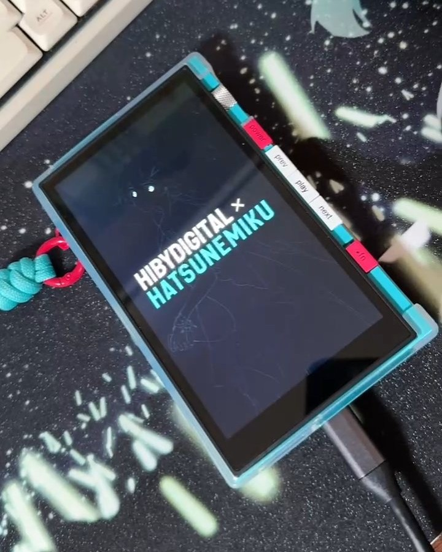
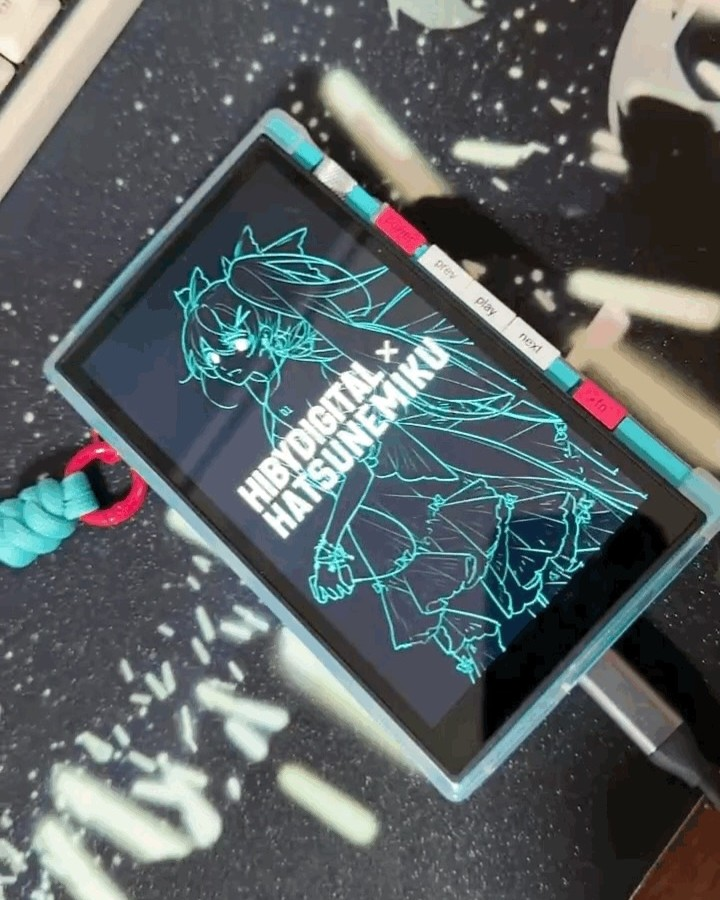
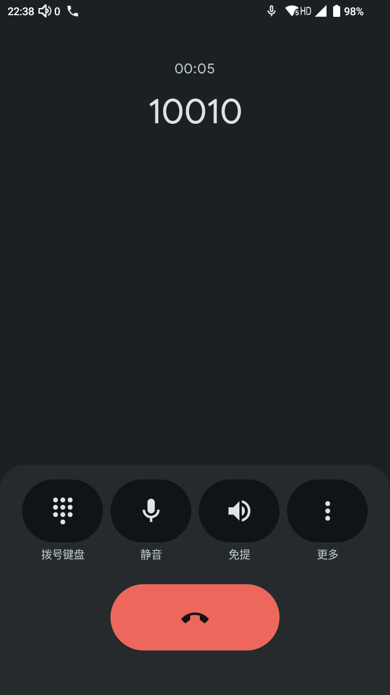
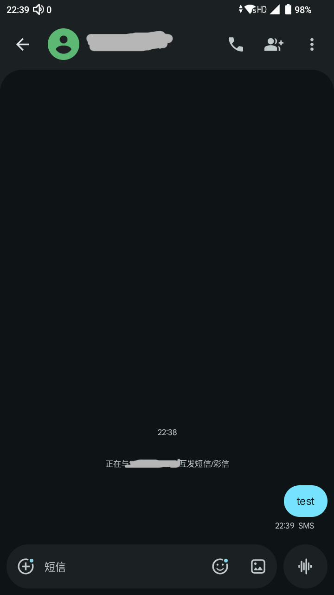

+++
title = '星海贝M500初音未来联名(Hiby M500_MIKU)折腾记录'
date = 2026-03-23T17:09:51+08:00
draft = false
tags = ["玩机"]
+++

前段时间在Hiby国际网站买了初音联名M500，其实我本人并不是什么 Hifi 玩家，但是关键是，它是初音联名啊，而且买之前我发现海鲜市场上有4G版解锁拨号盘和信息功能，下单回来折腾一下。

## 拆箱

什么，你以为会有图吗，网上那么多拆箱图去看一下就行了，我才懒得传图。

有点意思的是，国际版设备开机之后，BL锁直接是没锁的，要不是我收到的日期和生产日期只差一周，那我肯定怀疑买到摸摸机了，不过后面的一些探索证明了它可能的确是Hiby故意不锁的。

## Root 思路

说实话，我已经很久很久没有玩过安卓机了，我印象中的刷机还是先安装 TWRP，不过仔细回忆一下，现在似乎是用 Magisk 之类的，刚拿到机器的时候甚至有点修为尽失的感觉，还好现在还有 Claude。

言归正传， root 思路都差不多，这台机器较为简单。

1. 9008 回读所有分区，先备份
    - 这台机器并没有刷写过 eFuse, 9008 可以用同 cpu 的 Firehose 随便进。
    - 关机按 prev + next 插数据线进入 9008。
2. 安装 Magisk。
3. 复制回读的 init_boot 分区到手机内，用 Magisk 修补。
4. 用 9008 或者 fastboot，爱用啥用啥，写回 init_boot。
    - 关机按 next 插数据线进入 fastboot。

## 启动第一屏更改

这个设备的第一屏不知道为什么做得十分奇怪，对比度太低，再加上自己是 LCD 屏，根本看不清楚。



好在上面我们已经从 9008 提取出了分区，一般来说第一屏在 splash 分区内，我们只需要用工具拆包 splash.img ，修改图片后打包再刷入就好了，完成后的样子是这样的。



你问我用什么工具？相信能找到这篇文章的你一定有能力找到相关的工具，实在没有的话让你的超级大脑去问问超级ai就好啦。

## 隐藏功能

我购买的 4G 版，这里有个坑，国际版官方网站写了兼容中国网络，但是实际上它所支持的频段并不包含**中国联通**，对中国移动的支持也较差，只有**中国电信**是完美使用的。

作为一个播放器。理所当然是不能打电话发短信的。系统也没有自带短信和电话相关的应用，但是既然有 google play ，怎么会有人不想试试去 google play 安装一下 GMS 下的电话和短信呢？

不出所料。电话和短信安装上就能使用，丝滑。

   


## 启动器相关的折腾

### 起始

其实刚开始，我是想安装个三方启动器完事的，凭自己十多年前的印象搜了一下，那个叫 Apex Launcher 的启动器多年前就不更新了。Nova Launcher 还在更新，就先装上试试看吧，唉，现在的它怎么还内嵌广告了呢……再去查了一下，原来项目已经被收购了，看起来也算名存实亡。

装也装上了，那想办法把系统原生 Launcher 禁用了吧。咦，老娘的全面屏手势呢？谁家好人把全面屏手势的包打包进 Launcher 里啊？？？

看来禁用是不行了。留着吧，结果发现全面屏手势在桌面上拉起任务视图的时候，交互过程非常丑，满满的第三方不兼容感。算了算了，还是用官方吧。


### 图标

官方自带了一套初音图标，但是上面我们装了 google 的拨号盘和短信应用，那官方这一套肯定是没有这两个应用的图标的，而且官方这套图标还有些其他的没有，应用装多了就会显得很突兀。

这时候，我使用了 [global-icon-pack-android](https://github.com/RichardLuo0/global-icon-pack-android) 这个项目来自定义图标。


### 图标强迫症

之后我发现 launcher 的主屏幕设置，在开启初音主题时，设置里会多一个使用初音图标的选项，那我都用 xp 组件自己设置图标了我还得看着这个选项，而且这个选项的优先级还在 xp 的 hook 点之后，这我哪能忍，我得想办法给它改掉。

有了想法之后，我提取了 launcher 的 app，开始逆向。

提取出来先看一下签名，哈哈 AOSP 的 test key， 这下方便了，回编译签名能直接覆盖安装，甚至因为这个测试 key，还有了更多奇奇怪怪的玩法

下面是我的修改点和修改过程

<details>
<summary>点击展开修改过程</summary>

```pwsh
# 使用 -r 参数不解包资源，回编译不报错
java -jar .\apktool_3.0.1.jar d .\input\Launcher3QuickStep.apk -o .\output\Launcher3QuickStep -f -r
# 修改后回编译
java -jar .\apktool_3.0.1.jar b .\output\Launcher3QuickStep\  -f
# 对齐
.\build-tools\34.0.0\zipalign.exe -f 4 .\output\Launcher3QuickStep\dist\Launcher3QuickStep.apk .\output\Launcher3QuickStep\dist\Launcher3QuickStep_aligned.apk
# 签名
.\build-tools\34.0.0\apksigner.bat sign --key .\security\testkey.pk8 --cert .\security\testkey.x509.pem --out .\output\Launcher3QuickStep\dist\Launcher3QuickStep_sign.apk .\output\Launcher3QuickStep\dist\Launcher3QuickStep_aligned.apk
# 安装
adb install -r .\output\Launcher3QuickStep\dist\Launcher3QuickStep_sign.apk
# 清除缓存生效
PS C:\Users\soragoto\app\sdk> adb shell pm clear com.android.launcher3
```

1. 未进行任何设置时，默认不启用初音图标。
    ```
    \smali_classes7\com\android\launcher3\states\IconStyleHelper.smali
    ```

    找到 `getAllowIconStyleDefaultValue()` 方法，将返回值从 `0x1`（true）改为 `0x0`（false）：

    ```smali
    .method public static getAllowIconStyleDefaultValue()Z
        .locals 1

        .line 40
        const/4 v0, 0x0    ← 改这里（原来是 0x1）

        return v0
    .end method
    ```

    原理：

    - `ChangeAppIcon` 类在加载每个应用图标时会调用 `currentSettingIconStyle()` 判断是否替换
    - `currentSettingIconStyle()` 读取 SharedPreferences 的 `pref_allowIconStyle` 字段
    - `getAllowIconStyleDefaultValue()` 提供该字段的**默认值**
    - 将默认值改为 `false`，再清除应用数据后，图标替换功能即关闭


2. 从设置界面隐藏"启用个性化图标"选项并彻底禁用

    由于使用 `-r` 参数反编译，资源文件为二进制无法直接编辑，需通过修改 smali 实现以下更改。

    - 从设置界面移除该选项

    文件路径：
    ```
    \smali_classes7\com\android\launcher3\settings\SettingsActivity$LauncherSettingsFragment.smali
    ```

    找到 `initPreference()` 方法中的 `:pswitch_2` 分支（对应 `pref_allowIconStyle`），将整个分支简化为直接返回 `false`（即 `v2`），使该 preference 被 `onCreatePreferences()` 的循环自动调用 `removePreference()` 删除。

    原始代码：
    ```smali
        :pswitch_2
        invoke-static {}, Lcom/android/launcher3/states/IconStyleHelper;->getAllowIconStyleDefaultValue()Z

        move-result v0

        invoke-static {v0}, Ljava/lang/Boolean;->valueOf(Z)Ljava/lang/Boolean;

        move-result-object v0

        invoke-virtual {p1, v0}, Landroidx/preference/Preference;->setDefaultValue(Ljava/lang/Object;)V

        .line 306
        return v3
    ```

    修改后：
    ```smali
        :pswitch_2
        return v2
    ```

    > `v2 = 0x0`（false）：`initPreference()` 返回 false → preference 被移除  
    > 原先的 `setDefaultValue()` 调用会触发 SharedPreferences 写入，不能保留


3. 阻止进入/退出设置时触发 launcher 重启

    文件路径：
    ```
    \smali_classes7\com\android\launcher3\settings\SettingsActivity.smali
    ```

    找到 `onSharedPreferenceChanged()` 方法。

    **原始逻辑**：检测到 `pref_allowIconStyle` 变化时，将 `iconStyleChanged` 置为 `true`，`onPause()` 检测到后调用 `Process.killProcess()` 重启 launcher。

    **问题根源**：binary XML 中 `pref_allowIconStyle` 的 `defaultValue="true"` 在 preference 加载时会直接写入 SharedPreferences，触发此监听器，导致每次进设置再退出都会重启一次。

    修改后，改为将 `pref_allowIconStyle` 强制写回 `false`，同时不设 `iconStyleChanged`：

    ```smali
    .method public onSharedPreferenceChanged(Landroid/content/SharedPreferences;Ljava/lang/String;)V
        .locals 3
        .param p1, "sharedPreferences"    # Landroid/content/SharedPreferences;
        .param p2, "key"    # Ljava/lang/String;

        .line 150
        const-string v0, "pref_allowIconStyle"

        invoke-virtual {v0, p2}, Ljava/lang/String;->equals(Ljava/lang/Object;)Z

        move-result v0

        if-eqz v0, :cond_0

        .line 151
        invoke-interface {p1}, Landroid/content/SharedPreferences;->edit()Landroid/content/SharedPreferences$Editor;

        move-result-object v0

        const-string v1, "pref_allowIconStyle"

        const/4 v2, 0x0

        invoke-interface {v0, v1, v2}, Landroid/content/SharedPreferences$Editor;->putBoolean(Ljava/lang/String;Z)Landroid/content/SharedPreferences$Editor;

        move-result-object v0

        invoke-interface {v0}, Landroid/content/SharedPreferences$Editor;->apply()V

        .line 153
        :cond_0
        return-void
    .end method
    ```

</details>

### 强迫症治好了吗

并没有，我还想从抽屉里隐藏图标，我还发现横屏看起来这么像磁带播放器的一台设备启动器居然不支持横屏，我无法接受。逆都逆了，想办法修改一下吧。

改 smali 增加复杂逻辑还是太吃操作了，主播主播，有没有更简单一点的办法？

有的，兄弟，有的有的，快使用无敌的 Xposed。

于是就有了 这个项目 [m500_miku_plus](https://github.com/dev-soragoto/m500_miku_plus)


## 播放器的音质

不是，真的有 Hifi 佬搜到这篇文章并且看到现在吗？
那的确我还研究了一下这个设备能不能绕过 SRC。

不过这些留着我之后再更新吧。


## 后记

在安卓厂商日渐封闭化的今天。居然给我买到了一个**不锁BL**、**AOSP TEST KEY 签名**、**未烧录 Efuse**的设备，这三个东西不可能在整个发布流程中没有人测试到，反而倒像是开发者之间心照不宣的默契。

—— 在2026年，还能够连通的9008端口，像极了这座埋葬了玩机的赛博坟场中仍然在飞舞着的电子萤火虫。