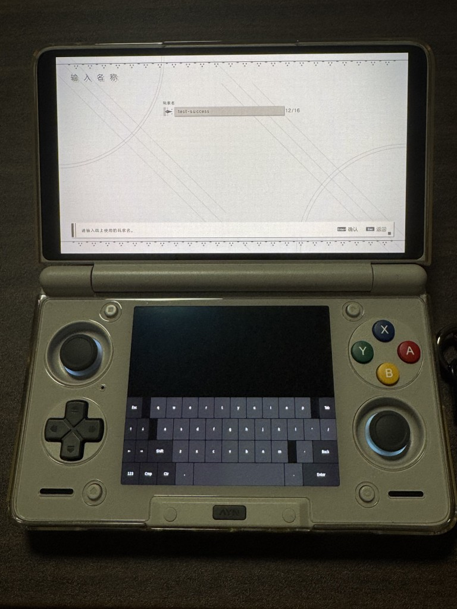

+++
title = 'Rocknix 中屏幕键盘的配置'
date = 2026-04-26T01:17:15+08:00
description = "记录在 Ayn Thor 的 Rocknix 系统中配置 Sway/Wayland 屏幕键盘 wvkbd，解决无物理键盘输入问题。"
tags = ["玩机","Rocknix","Ayn Thor","Sway","Wayland","屏幕键盘","wvkbd"]
+++

## 序言

在我使用 Ayn Thor 安装 Rocknix 后，我发现这个系统没有全局的屏幕键盘，这样产生了很多不便，比如 [Ayn Thor Linux(Rocknix) 的安装和折腾过程](../../ayn-thor/) 中提到的，游戏里打不了字完全无法创建角色的问题。


## 效果



## 方法

首先先看看 Rocknix 上有哪些屏幕键盘，无敌的 Gemini 告诉我说，可以试试 `wvkbd` 或者 `wvkbd-mobintl` 

我们 SSH 上去看看

```
SM8550:~ # wvkbd-mobintl
Initializing keyboard
Found 54 layouts
Found 2 layers
Resize 1920x120 1.000000, 55 layouts
```

看来成功拉起来了，那现在问题是想办法给它拉到副屏上去，这样比较优雅，毕竟我使用的是神奇的双屏掌机嘛。

首先，确认一下双屏的屏幕名称

```
SM8550:~ # swaymsg -t get_outputs
Output DSI-2 'Unknown Unknown Unknown' (focused)
  Current mode: 1080x1920 @ 120.000 Hz
  Power: on
  Position: 0,0
  Scale factor: 1.000000
  Scale filter: nearest
  Subpixel hinting: unknown
  Transform: 90
  Workspace: 1
  Max render time: off
  Adaptive sync: disabled
  Allow tearing: yes
  Available modes:
    1080x1920 @ 120.000 Hz
    1080x1920 @ 60.000 Hz

Output DSI-1 'Unknown Unknown Unknown'
  Current mode: 1080x1240 @ 59.999 Hz
  Power: on
  Position: 1920,0
  Scale factor: 1.000000
  Scale filter: nearest
  Subpixel hinting: unknown
  Transform: 90
  Workspace: 2
  Max render time: off
  Adaptive sync: disabled
  Allow tearing: no
  Available modes:
    1080x1240 @ 59.999 Hz
```

看分辨率，显然 `DSI-1` 就是副屏了，我们尝试在副屏拉起键盘，并且调整一下键盘高度，让它好看点。

```
SM8550:~ # wvkbd-mobintl --output DSI-1 -L 500
wvkbd: preferred output set to: "DSI-1"
wvkbd: assigned preferred output to: DSI-1
Initializing keyboard
Found 54 layouts
Found 2 layers
Resize 1240x500 1.000000, 55 layouts
```

看起来很顺利，成功拉起来了键盘，此时其实已经可以去游戏里测试一下了，打开游戏，在 SSH 中拉起键盘，这时候键盘已经可以打字了，但是这样太不优雅了，我不能每次玩游戏都带个电脑运行命令拉起键盘吧，那我接个 USB 键盘可能还更快点。

我得想办法给键盘做个快捷键，这样就可以在游戏中用快捷键触发了，在这之前，需要先抓到快捷键的键值，我是想用 `home` + `back` (就是机器下面那两个小的按键)，我们运行 `evtest` 选择 Xbox 控制器，之后分别按下两个键看看输出。

```
Event: time 1777096805.111927, type 1 (EV_KEY), code 316 (BTN_MODE), value 1

Event: time 1777096805.111927, -------------- SYN_REPORT ------------

Event: time 1777096805.278486, type 1 (EV_KEY), code 316 (BTN_MODE), value 0

Event: time 1777096805.278486, -------------- SYN_REPORT ------------

Event: time 1777096806.467924, type 1 (EV_KEY), code 167 (KEY_RECORD), value 1

Event: time 1777096806.467924, -------------- SYN_REPORT ------------

Event: time 1777096806.612957, type 1 (EV_KEY), code 167 (KEY_RECORD), value 0

Event: time 1777096806.612957, -------------- SYN_REPORT ------------
```

很明确了，键值一个 316 一个 167，可惜 Rocknix 使用的 Sway 并不支持这种没有修饰键的按键组合触发，所以我们需要自己做一个脚本来实现这个功能。

先找一下 Sway 的 sock 放在哪里

```
SM8550:~ # find /run /var/run -name "sway-ipc*.sock" 2>/dev/null
/run/0-runtime-dir/sway-ipc.0.sock
```

之后我们用一个 python 脚本来实现我们想要的功能 (Rocknix 预装了 python ，我们并不用引入其他东西)

```python
#!/usr/bin/env python3
import struct
import subprocess
import time
import os
import glob
import sys

# Format: time_sec, time_usec, type, code, value
FORMAT = 'iiHHi' if struct.calcsize('l') == 4 else 'llHHi'
EVENT_SIZE = struct.calcsize(FORMAT)

# Keycodes
BTN_MODE = 316
KEY_RECORD = 167
CONFIRMED_SWAYSOCK = "/run/0-runtime-dir/sway-ipc.0.sock"

def log(msg):
    """Compact logging: writes message and flushes immediately without extra newlines."""
    sys.stdout.write(f"{msg}\n")
    sys.stdout.flush()

def get_gamepad_device():
    """Scan all input devices to find the Xbox controller dynamically."""
    for dev in glob.glob('/dev/input/event*'):
        try:
            with open(f'/sys/class/input/{os.path.basename(dev)}/device/name', 'r') as f:
                name = f.read().strip()
                if "Xbox" in name:
                    return dev
        except:
            continue
    return None

def setup_wayland_env():
    """Inject required Sway environment variables."""
    os.environ['SWAYSOCK'] = CONFIRMED_SWAYSOCK
    os.environ['XDG_RUNTIME_DIR'] = "/run/0-runtime-dir"
    os.environ['WAYLAND_DISPLAY'] = "wayland-1"

def toggle_keyboard():
    log("Combo triggered. Toggling keyboard.")
    setup_wayland_env()
    check_proc = subprocess.run(['pgrep', '-x', 'wvkbd-mobintl'], stdout=subprocess.DEVNULL)
    if check_proc.returncode == 0:
        log("Keyboard running. Killing...")
        subprocess.run(['killall', 'wvkbd-mobintl'])
    else:
        log("Keyboard not running. Launching...")
        try:
            subprocess.Popen(['swaymsg', 'exec', 'wvkbd-mobintl --output DSI-1 -L 500'])
        except Exception as e:
            log(f"Launch error: {e}")

def main():
    mode_held = False
    log("Service starting...")

    while True:
        device_path = get_gamepad_device()
        if not device_path:
            log("Searching for Xbox controller...")
            time.sleep(3)
            continue

        try:
            with open(device_path, 'rb') as f:
                log(f"Success: Hooked into {device_path}")
                while True:
                    event = f.read(EVENT_SIZE)
                    if len(event) == EVENT_SIZE:
                        _, _, ev_type, ev_code, ev_value = struct.unpack(FORMAT, event)
                        if ev_type == 1:
                            if ev_code == BTN_MODE:
                                mode_held = (ev_value == 1)
                            elif ev_code == KEY_RECORD and ev_value == 1:
                                if mode_held:
                                    toggle_keyboard()
        except Exception as e:
            log(f"Device error or lost: {e}. Re-scanning...")
            time.sleep(3)

if __name__ == '__main__':
    main()
```

我把这个脚本存储为 `/storage/scripts/Smart_Listener.py`，此时，在 SSH 中执行脚本，我们已经能做到使用快捷键拉起副屏键盘了。

之后我们需要使用 systemd 来做开机自启动，新建一个文件 `/storage/.config/system.d/kb-combo.service` 写入以下内容

```
[Unit]
Description=Keyboard Combo Listener
After=multi-user.target

[Service]
ExecStart=/usr/bin/python3 /storage/scripts/Smart_Listener.py
Restart=always
RestartSec=5
User=root

[Install]
WantedBy=multi-user.target
```

接下来素质三连，完成我们的配置。

```bash
systemctl daemon-reload
systemctl enable kb-combo.service
systemctl start kb-combo.service
```
