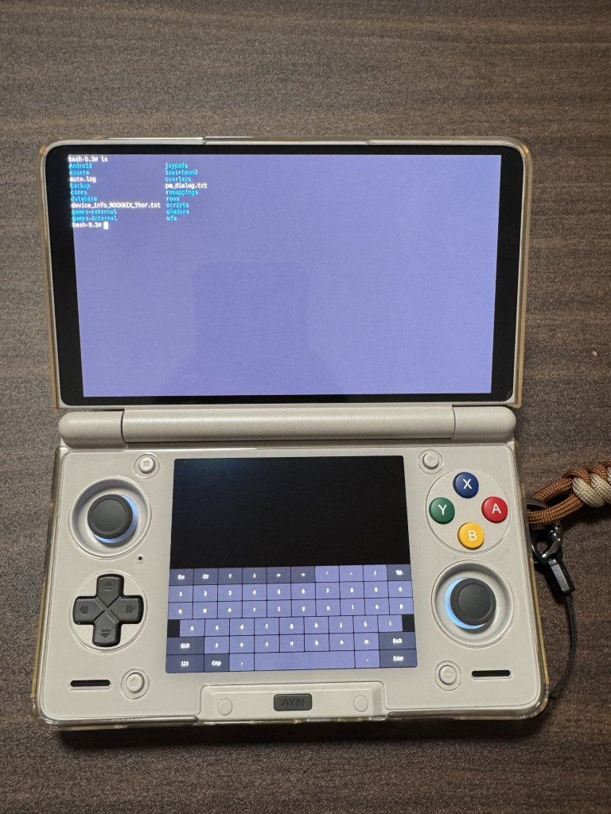

+++
title = 'Rocknix 添加带虚拟键盘的 Shell'
date = 2026-04-26T01:17:15+08:00
tags = ["玩机","Rocknix","Ayn Thor","Sway","Wayland","虚拟键盘","Shell"]
+++

## 前言

其实在 Rocknix 的 Tools 目录下，有 QTerminal 这个终端，配合上我在 [这篇文章](../rocknix-1/) 中配置的屏幕键盘，已经可以不用物理键盘就能控制终端了，可是这个东西实在太丑了，不够优雅。我们得想想办法。

## 效果



## 实现

使用一个脚本来实现，我把它存储为 `/roms/ports/Bash.sh` 这样，前端会直接扫描到脚本，可以通过桌面上的 `ports` 运行。

```sh
#!/bin/bash
(
    sleep 2
    swaymsg workspace 1
    swaymsg 'for_window [app_id="foot"] fullscreen enable'
    wvkbd-mobintl --output DSI-1 -L 500 &
    foot -f monospace:size=18 -e bash
    killall wvkbd-mobintl
) & disown
```

为了防止意外，我还另外写了 `Clear_MainScreen.sh` `Clear_SubScreen.sh` 两个脚本也放在同样的目录下，用于关闭主屏和副屏上运行的应用。

```sh
#!/bin/bash
swaymsg '[workspace="1"] kill'
killall wvkbd-mobintl
swaymsg workspace 1
```

```sh
#!/bin/bash
swaymsg '[workspace="2"] kill'
killall wvkbd-mobintl
swaymsg workspace 1
```
