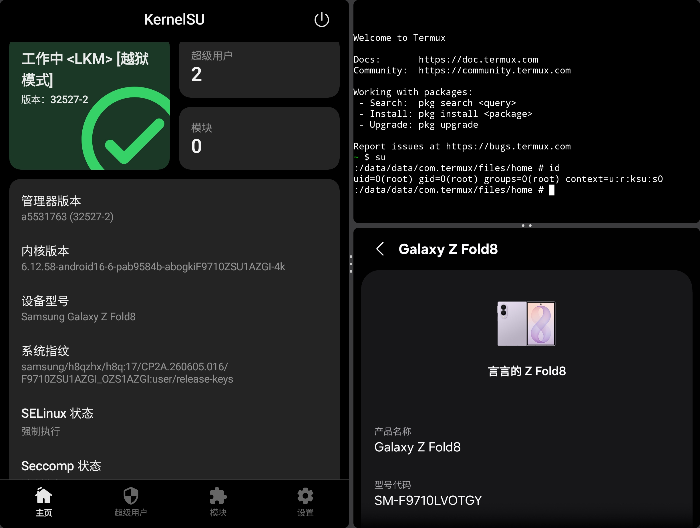

+++
title = '我是怎样 Root 我的 Z Fold8 的：写在开始之前'
description = '我是怎样 Root 我的 Z Fold8 的：写在开始之前'
weight = 1
tags = ['玩机', 'Z Fold8', 'Root']
date = 2026-09-07T09:27:20+08:00
+++

## 缘起

已经有好几年没有把 Android 机当主力机去用了，主要是因为现代 Android 权限收得越来越紧， root 越来越难，更别说什么自签 avb 这种操作了，让机器的选择基本只能锁定在 pixel 这种完美副机上。

那我为什么去买了 zfold 8 呢，那还得是因为 2026 年的年度密码找回，提权大戏，zfold8 的发布，卡在了一个非常暧昧的 timming 上，就在发布前不久 cve-2026-43499 横空出世，然后我看着 zold8 这个机器的外观和形态，越看越喜欢，买之前先静态分析一下吧，我去 [https://samfw.com/](https://samfw.com/) 下载了目标固件，提取了 boot.img 找 deepseek 老师进行了一波静态分析，d老师告诉我攻击面还在，那还说什么呢，激情下单！

## 结论

我这种人，不成功是万万不会来写博客去回味我到底怎么做的，既然你能看到这篇文章，那就证明我一定成功了。

## 正文前你需要知道的

此次 root 的大多数操作都是我借助 AI 完成的，我本人并非什么安全从业者，此次甚至是我第一次调试 kernel，这篇文章整体仅仅是我在做完后回来学习记录而写。其中必然有很多操作和正常安全从业者偏差非常大(比如硬看汇编，连个 ida 都没有(~~甚至连 ida 是什么都不一定知道~~)，毕竟也不是我来看)，但是总体做下来，我觉得自己还是学会了一些安全方面的方法论的，我觉得有必要来记录一下。

## Q&A

Q: 为什么你的 AI 愿意给你干这活，我的只会 cyber secure 警告？

: A: 或许你可以中文搜索 `破甲` ，或者英文搜索 `instruct` 等东西，你会发现新世界。当然，你可以在万能的赛博黑市找到什么 `cvp` 还有什么 `蓝队模型`，这可能是我关于 zfold8 root 系列文章里最大的信息差了，当然，怎么掌握这种信息差，可能也算是搜索能力的一部分吧，事实上，我的确是第一次知道这种东西。

Q: 都tm是 AI 帮你干的，那你写文章干嘛？

: A: 那你为啥来看呢？

Q: 你这文章不会也是 AI 写的吧？

: A: 大多数还是人类写的，不排除有少量 AI 痕迹。

## 关于参考资料

这一路折腾过来，我参考了很多开源仓库、安全研究和技术文章(甚至最后的成功结果，也来源于后面他人开源过的 `io-submit` 方案)。这些参考资料有些提供了可以拿来尝试的代码，有些帮我理解了问题，还有些让我一个完全不懂安全的人第一次知道，原来大概应该这么去干才会有结果。

这里先谢谢愿意公开代码和分享研究过程的人。具体的参考资料，我会在后面的文章里结合实际过程展开，并在对应的位置附上来源。

## 其他

前面忘了，原来我早就是天才程序员了.jpg